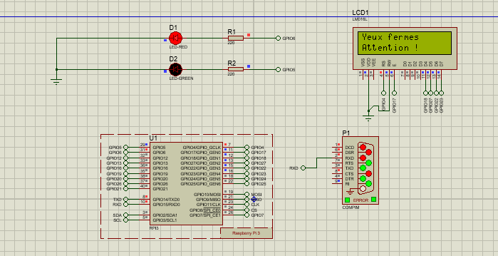
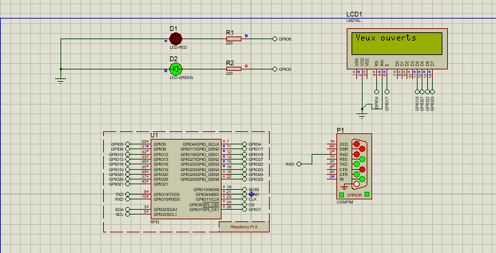

# Détection des Yeux Ouverts / Fermés avec Raspberry Pi et Proteus

## Description du Projet

Ce projet permet de détecter en temps réel si les yeux d'une personne sont **ouverts** ou **fermés** à l'aide d'une **webcam**.  
Le modèle est entraîné avec un **dataset téléchargé depuis Kaggle** pour la classification yeux ouverts / yeux fermés.  

L’état détecté est ensuite envoyé via **port série** vers un **Raspberry Pi** ou une **simulation Proteus**, qui affiche l’information sur un **LCD 16x2** et contrôle deux LEDs :  

- LED verte (GPIO 29) : Yeux ouverts  
- LED rouge (GPIO 31) : Yeux fermés  
Ce projet permet de détecter en temps réel si les yeux d'une personne sont **ouverts** ou **fermés** à l'aide d'une **webcam**.

Le modèle est entraîné avec un **dataset téléchargé depuis Kaggle** pour la classification yeux ouverts / yeux fermés.

L’état détecté est ensuite envoyé via **port série** vers un **Raspberry Pi** ou une **simulation Proteus**, qui affiche l’information sur un **LCD 16x2** et contrôle deux LEDs :

- LED verte (GPIO 29) : Yeux ouverts
- LED rouge (GPIO 31) : Yeux fermés
Lorsque le système est en attente, les deux LEDs sont éteintes.

## Captures d’Écran

### Yeux fermés


### Yeux ouverts


## Fonctionnement
1. **Entraînement du modèle**  
   - Dataset Kaggle avec images d’yeux ouverts et fermés  
   - Prétraitement avec MobileNetV2 et ImageDataGenerator  
   - Modèle entraîné avec TensorFlow et sauvegardé sous `eyes_detector.model.h5`  

2. **Détection en temps réel sur PC**  
   - Capture webcam avec OpenCV  
   - Détection d’yeux avec Haar Cascade  
   - Classification ouvert / fermé via le modèle entraîné  

3. **Communication avec Raspberry Pi / Proteus**  
   - Envoi du signal via **port série** : `0` pour yeux ouverts, `1` pour yeux fermés  
   - Contrôle LEDs et affichage sur LCD  

## Créer un environnement virtuel

### Windows
```bash
python -m venv env_eyes
env_eyes\Scripts\activate
```
###Linux / Mac
```bash
python3 -m venv env_eyes
source env_eyes/bin/activate
```
##Installer les dépendances
```bash
pip install -r requirements.txt
```
##Exécution du Projet
###Sur PC
```bash
python detect_eyes_serial.py
```
* Affichage webcam avec détection yeux ouverts / fermés

* Envoi de l’état au port série (COM virtuel)

##Sur Proteus / Raspberry Pi
* Connexion du port série virtuel au Raspberry ou Proteus

* LED verte / rouge et affichage LCD 16x2 selon l’état reçu

##Fichiers Principaux
`detect_eyes_serial.py` : Détection et envoi des résultats

`eyes_detector.model.h5` : Modèle entraîné

`requirements.txt` : Dépendances Python

`dataset/` : Images yeux ouverts / fermés pour entraînement


